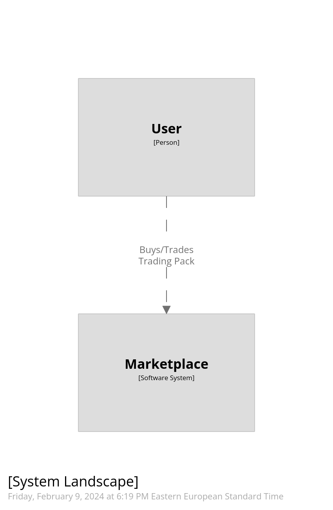
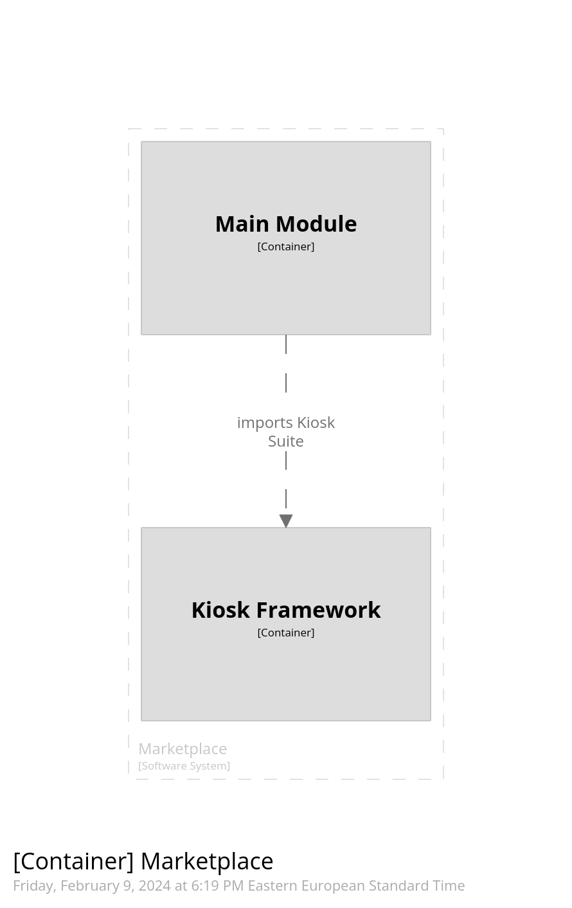
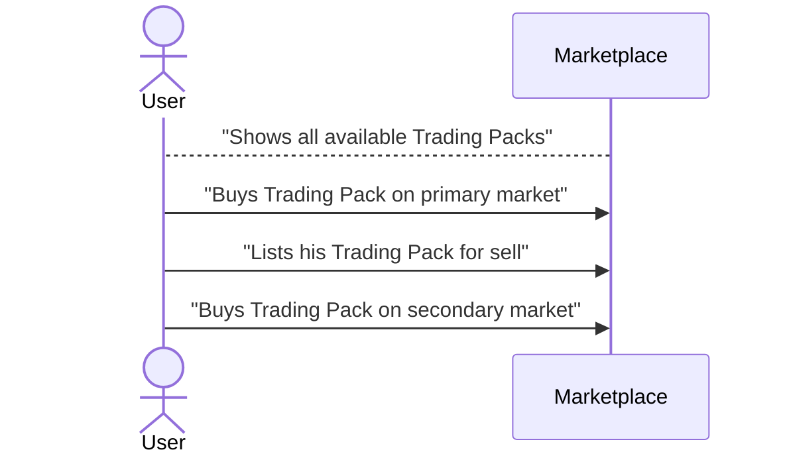

# Kiosk Example with Marketplace functionality

## Project details
The idea here is a trading card game that will consists of trading packs that contain trading cards.
These should be tradable and the requirement is for 3% royalties.

Move code can be found in sources/.

PTB flows and examples can be found in scripts.

A publish script example is a also available, this requires sui client installed.

## Getting started

- Navigate to scripts/ folder and run `pnpm i`
- Edit the scripts/constats.ts file and set your desired network.
- Navigate to scripts/publishing and run `ts-node publishPackage.ts`
- Create an .env file in scripts (`scripts/.env) and add the following line:
`ADMIN_KEY=<base64 Key>`. You can find the `<base64 Key>` with `cat ~/.sui/sui_config/sui.keystore`.
- To fill up your constants and before starting exploring calls the 

`scripts/flows/create_transfer_policy_flow.ts` and `scripts/flows/mint_cap_flow.ts` should be run first.


In the design we have an `AdminCap` that should be kept as secure as possible and a `MintCap` that is soulbound
and can be minted by the `AdminCap` owner for any address. In case of a breach, the `MintCap` can be deleted since
it cannot be transferred.
All the flows that the backend should do during the lifetime of the project only require a `MintCap`.

`scripts/transactions.ts` contain all the move calls towards the chain for the contract we designed.

`scripts/flows/` contain the flows possible by different actors and combine the transactions in PTBs and execute the ones
done by the backend (`MintCap` owner). The calls for the players accept a `walletSignAndExecute` that in a full solution can be imported from `@mysten/dapp-kit`. If you want to test you can create a new `signAndExecute` that accepts a different keypair from the admin one and provide it those functions. Trivially it can also be tested with the existing `signAndExecute` in `scripts/utils.ts`.

`scripts/utils.ts` creates the keypair, and exports the address and a `signAndExecute` method.
`flows/helpers.ts` contain utilities from the Kiosk SDK.


## Design

### User stories

User can purchase Trading Packs from the marketplace.

User can trade Trading Packs on the marketplace.

— Future —

User can open Trading Packs to get Trading Cards with random rarity.

User can play Trading Card Game.

User can trade Trading Cards on the marketplace.

### Diagrams

Pretty simple due to this being a short project.







### Move Design

trading_pack.move

```rust
    // Witness
    struct TRADING_PACK has drop {}

    // shared object with transfer policys and kiosk
    struct Central has key {
        id: UID,
        kiosk_cap: KioskOwnerCap,
        empty_policy: TransferPolicy<TradingPack>,
        policy_cap: TransferPolicyCap<TradingPack>
    }

    // We want to keep the supply limited so all packs will be minted in a Kiosk by an Admin.
    struct TradingPack has key, store {
        id: UID,
        tier: u8,
        season: String        
    }

    struct Present has key {
        id: UID,
        packs: vector<TradingPack>
    }

    struct MintCap has key {
        id: UID,
    }

    fun init(witness: TRADING_PACK, ctx: &mut TxContext) {
			  // create publisher and send to caller
        // create and share central with its fields
    }

    // Admin-only funs
    public fun mint_cap(_: &AdminCap, recipient: address, ctx: &mut TxContext) {
        // mintCap needs to be transferred because it is soul-bound
    }

    // MintCap owner funs

    public fun delete_mint_cap(cap: MintCap) {}

    public fun mint(
       _: &MintCap,
       tier: u8,
       season: String,
       ctx: &mut TxContext): TradingPack {}

    public fun place_and_list_to_kiosk(
        _: &MintCap,
        central: &mut Central,
        kiosk: &mut Kiosk,
        pack: TradingPack,
        price: u64,
        _ctx: &mut TxContext
    )
    {}

    // In case we want to airdrop
    public fun airdrop(
      _: &MintCap,
      packs: vector<TradingPack>,
      recipient: address, 
      ctx: &mut TxContext) {}

    // This can be done with PTBs. We'll implement it as an example or convenience.
    // We're minting trading packs and putting them for sale
    public fun mint_many_to_kiosk(
        _: &MintCap,
        central: &mut Central,
        kiosk: &mut Kiosk,
        tier: u8,
        season: String,
        amount: u64,
        price: u64,
        ctx: &mut TxContext
    )
    {}

    // Player funs

    /// Allows to unrwap a present and puts the TradingPacks into the player's kiosk.
    public fun unwrap(present: Present, kiosk: &mut Kiosk, kiosk_cap: &KioskOwnerCap, policy: &TransferPolicy<TradingPack>) {
				// destroy TradingPack vector and lock them into kiosk
    }

    // here we need to unlock the pack and we'll stop at destroying it, but in the full solution
    // it would re-lock the resulting cards into the kiosk
    public fun open_pack_from_kiosk(
        central: &mut Central,
        kiosk: &mut Kiosk,
        kiosk_cap: &KioskOwnerCap,
        pack_id: ID,
        ctx: &mut TxContext) 
    {}
```

admin.move
```rust
  // Only one instance of this will be created
  struct AdminCap has key, store{
        id: UID
    }

    fun init(ctx: &mut TxContext) {
        // create and AdminCap and send to caller.
    }

    // Allow the cap to be burned when project finishes the lifecycle.
    public fun burn(cap: AdminCap) {}
```